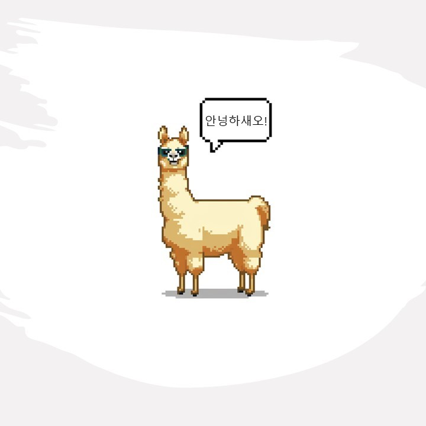
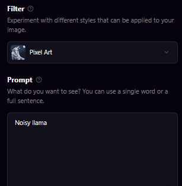

# KoNEFTune(Kosy🍵llama)
<div align='center'>
   
<br>
<strong>Random Noisy Embeddings with fine-tuning 방법론을 llama2에 적용한 코지라마(Kosy🍵llama)</strong>  
    
---
</div>
  
# Introduction about NEFTune
   
  
> More detail: [NEFTune github](https://github.com/neelsjain/NEFTune/tree/main) and [NEFTune paper](https://arxiv.org/abs/2310.05914).  
  
# Quick training code
```python
## In finetune.py,
## Only support the llama base model in code. 
import kosy_transformers
from kosy_transformers import TrainerCallback, TrainingArguments, TrainerState, TrainerControl
from kosy_transformers.trainer_utils import PREFIX_CHECKPOINT_DIR
from kosy_transformers import LlamaForCausalLM, LlamaTokenizer
from kosy_transformers import AutoModelForCausalLM, AutoTokenizer
```   
```python
!torchrun finetune.py \
    --base_model [...base_model...] \
    --data-path [...dataset...] \
    --output_dir [...output_dir...] \
    --batch_size [...batch_size...] \
    --num_epochs [...epochs...] \
    --learning_rate [...learning_rate...] \
    --lora_r [...lora_r...] \
    --lora_alpha [...lora_alpha...] \
    --lora_dropout [...lora_dropout...] \
    --lora_target_modules [...LORA_training_layer...] \
    --train_on_inputs False \
    --add_eos_token False \
    --group_by_length False \
    --prompt_template_name alpaca \
    --lr_scheduler [...lr_scheduler...] \
    --warmup_steps [...warmup_step...] \
    --noise_alpha [...NEFT_alpha...] 
```
> There are another hyperparameters option in [code](./finetune.py).  
  
# Core Code
```python
from torch.nn import functional as F
def NEFTune(model, noise_alpha=5):
    def noised_embed(orig_embed, noise_alpha):
        def new_func(x):
            # during training, we add noise to the embedding
            # during generation, we don't add noise to the embedding
            if model.training:
                embed_init = orig_embed(x)
                dims = torch.tensor(embed_init.size(1) * embed_init.size(2))
                mag_norm = noise_alpha/torch.sqrt(dims)
                return embed_init + torch.zeros_like(embed_init).uniform_(-mag_norm, mag_norm)
            else:
                return orig_embed(x)
        return new_func
    ##### NOTE: this is for a LLaMA2 model ##### 
    ##### For a different model, you need to change the attribute path to the embedding #####
    model.module.base_model.model.model.embed_tokens.forward = noised_embed(model.module.base_model.model.model.embed_tokens, noise_alpha)
    return model
```
You need to consider the ```embed_tokens``` location in your base model.  
> In my case, there is a 'infinitly recursive error' when diretly use. So, I introduced [new method](https://github.com/Marker-Inc-Korea/KoNEFTune/tree/main#method-applying-noisy-embedding-manually) (for Ko-LLM).  
  
# Method: Applying Noisy Embedding (manually)
```python
# In finetune.py
model = LlamaForCausalLM.from_pretrained(
    base_model,
    load_in_8bit=True,
    torch_dtype=torch.float16,
    device_map=device_map)

# Original
tokenizer = LlamaTokenizer.from_pretrained(base_model) # Llama2
print(type(model)) # <class 'transformers.models.llama.modeling_llama.LlamaForCausalLM'>
```
Here, you can see the class of model is ```LlamaForCausalLM```.  
**Now, You need to follow the below two steps!**   
  
```python
# In modelling_llama.py
class LlamaForCausalLM(LlamaPreTrainedModel):
    _tied_weights_keys = ["lm_head.weight"]

    def __init__(self, config):
        (... Define Model...)

    # We modify the below code.
    @add_start_docstrings_to_model_forward(LLAMA_INPUTS_DOCSTRING)
    @replace_return_docstrings(output_type=CausalLMOutputWithPast, config_class=_CONFIG_FOR_DOC)
    def forward(
        self,
        input_ids: torch.LongTensor = None,
        attention_mask: Optional[torch.Tensor] = None,
        position_ids: Optional[torch.LongTensor] = None,
        past_key_values: Optional[List[torch.FloatTensor]] = None,
        inputs_embeds: Optional[torch.FloatTensor] = None,
        labels: Optional[torch.LongTensor] = None,
        use_cache: Optional[bool] = None,
        output_attentions: Optional[bool] = None,
        output_hidden_states: Optional[bool] = None,
        return_dict: Optional[bool] = None,
    ) -> Union[Tuple, CausalLMOutputWithPast]:

    output_attentions = output_attentions if output_attentions is not None else self.config.output_attentions
    output_hidden_states = (
        output_hidden_states if output_hidden_states is not None else self.config.output_hidden_states
    )
    return_dict = return_dict if return_dict is not None else self.config.use_return_dict

    # decoder outputs consists of (dec_features, layer_state, dec_hidden, dec_attn)
    training_option = self.model.training # We add this.
    outputs = self.model(
        train_opt = training_option, # We add this.
        input_ids=input_ids,
        attention_mask=attention_mask,
        position_ids=position_ids,
        past_key_values=past_key_values,
        inputs_embeds=inputs_embeds,
        use_cache=use_cache,
        output_attentions=output_attentions,
        output_hidden_states=output_hidden_states,
        return_dict=return_dict,
    )

    # Below ... embed positions and training ...

```
First, we modify the ```LlamaForCausalLM Class```.   
   
```python
# In modelling_llama.py
class LlamaModel(LlamaPreTrainedModel):
    def __init__(self, config: LlamaConfig):
        (... Define Model...)

    # We modify the below code.
    @add_start_docstrings_to_model_forward(LLAMA_INPUTS_DOCSTRING)
    def forward(
        self,
        train_opt: bool,
        input_ids: torch.LongTensor = None,
        attention_mask: Optional[torch.Tensor] = None,
        position_ids: Optional[torch.LongTensor] = None,
        past_key_values: Optional[List[torch.FloatTensor]] = None,
        inputs_embeds: Optional[torch.FloatTensor] = None,
        use_cache: Optional[bool] = None,
        output_attentions: Optional[bool] = None,
        output_hidden_states: Optional[bool] = None,
        return_dict: Optional[bool] = None,
    ) -> Union[Tuple, BaseModelOutputWithPast]:
        
        (...Define argument...)

        # Here, we add the noisy embedding method.
        if inputs_embeds is None:
            inputs_embeds = self.embed_tokens(input_ids)

            # NEFTuning
            if train_opt: # If training,
              #print("Kyujinpy. Noisy embedding~")
              dims = torch.tensor(inputs_embeds.size(1) * inputs_embeds.size(2))
              mag_norm = [...noisy_alpha...]/torch.sqrt(dims) # noise_alpha/torch.sqrt(dims)
              inputs_embeds = inputs_embeds + torch.zeros_like(inputs_embeds).uniform_(-mag_norm, mag_norm)

        # Below ... embed positions and training ...
```
Second, we modify the ```LlamaModel Class```.   
> You can see the [our modified code](./KoNEFT_transformers/modeling_llama.py).  
    
```python
# In modified version,
if NEFTune:
  print("We modified the transformers version is 4.34.1")  
  print("The training code base is 'Platypus'.")  
else:
  print("Done!!")
```
> You need to consider the `transformers` version.   
  
# Model benchmark
(coming soon...)  

# (Option) Another method: Applying code
```python
embed_device = model.module.base_model.model.model.embed_tokens.weight.device
embeds_init = model.module.base_model.model.model.embed_tokens.forward(inputs['input_ids'].to(embed_device))

### add noise to embeds
input_mask = inputs['attention_mask'].to(embeds_init) # B x L
input_lengths = torch.sum(input_mask, 1) # B

noise_ = torch.zeros_like(embeds_init).uniform_(-1,1)
delta = noise_ * input_mask.unsqueeze(2)
dims = input_lengths * embeds_init.size(-1)
mag = 5 / torch.sqrt(dims) # args.neftune_alpha / torch.sqrt(dims)
delta = (delta * mag.view(-1, 1, 1)).detach()
inputs['inputs_embeds'] = delta + embeds_init
inputs['input_ids'] = None
### add noise to embeds
```
You can apply above code, in your custom code.   
When use above code, you need to add this code maybe in ```trainer.py -> 'training_step' function```.  
  
# TODO
- [x] Introduced the NEFTune method.
- [ ] Training Kosy-platypus.  
- [ ] Training Kosy-Orca-Platypus.    
- [x] User can adjust the noisy_alpha with config(parser).  
  
# References
[transformers](https://pypi.org/project/transformers/)  
[Platypus github](https://github.com/arielnlee/Platypus)  
[NEFTune github](https://github.com/neelsjain/NEFTune/tree/main)  
[KO-platypus🥮](https://github.com/Marker-Inc-Korea/KO-Platypus)  
[Korean-OpenOrca🐳](https://github.com/Marker-Inc-Korea/Korean-OpenOrca)  

# Kosy🍵llama Character
  
I use [Playground_AI](https://playgroundai.com/) site.  
Using stable-diffusion-XL and filter(Pixel_art), I made the Kosy🍵llama character. (Cosy: 아늑한)  

+) 말풍선 reference: [pinterest](https://www.pinterest.es/pin/975099756801242167/)  
